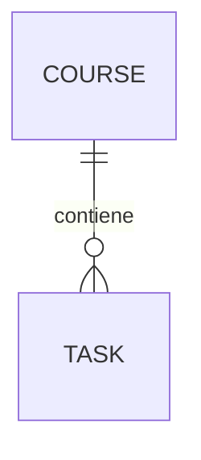
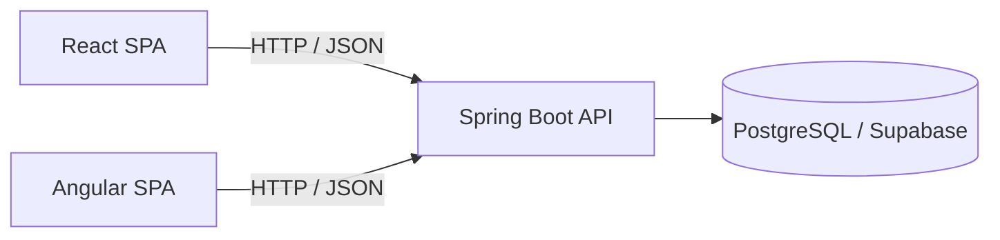
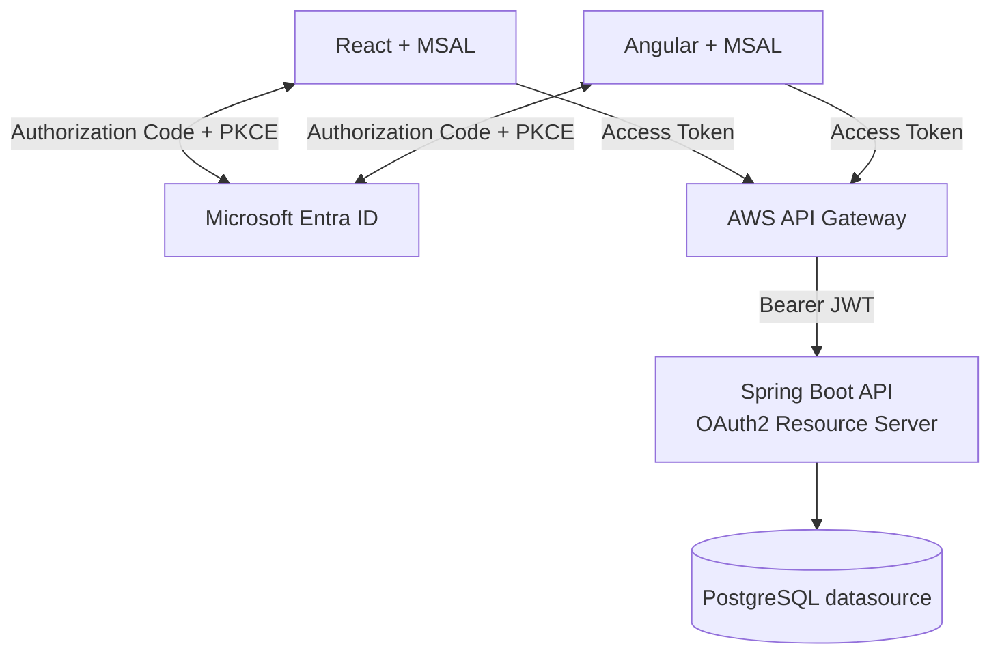
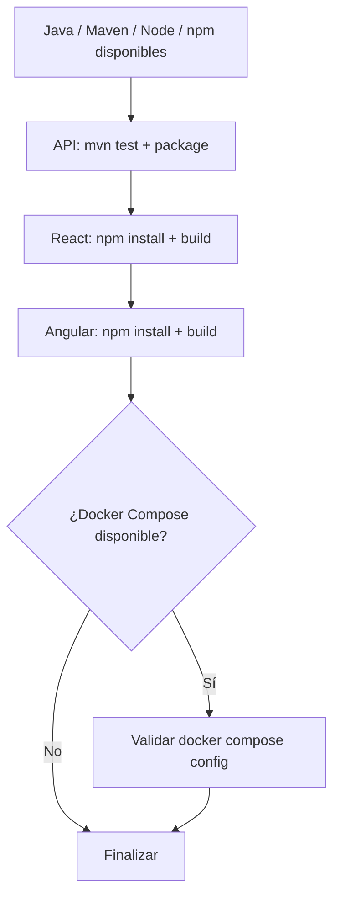

# DSY1107 · EV1 · Implementación de referencia

Monorepo multimódulo utilizado para implementar y validar de extremo a extremo los aprendizajes de EV1 de **DSY1107 Desarrollo Cloud Native I**.

El objetivo no es construir un sistema complejo. AulaTrack sirve como referencia técnica para demostrar que **dos SPA distintas pueden consumir el mismo backend y aplicar el mismo contrato de seguridad**.

## Aplicación: AulaTrack

Gestor docente mínimo de asignaturas y pendientes.



## Módulos

```text
DSY1107-EV1-IMPL/
├── api/             # Java 21 + Spring Boot · backend único
├── webapp-react/    # React + TypeScript + Vite
├── webapp-ng/       # Angular
├── docs/            # arquitectura y decisiones
├── infra/           # configuración cloud/documentación
├── scripts/         # validaciones rápidas
└── docker-compose.yml
```

Ambos frontends consumen exactamente la misma API REST.

## Arquitectura actual



La base de datos está detrás de la API. Ninguna SPA accede directamente a Supabase.

## Arquitectura objetivo EV1



## Contrato REST inicial

```text
GET    /public/info
GET    /api/courses
POST   /api/courses
GET    /api/tasks
GET    /api/tasks/{id}
POST   /api/tasks
PUT    /api/tasks/{id}
PATCH  /api/tasks/{id}/status
```

---

# 1. Quick check después de `git pull`

El quick check valida los tres módulos sin requerir una conexión real a Supabase.

Backend utiliza H2 únicamente durante tests automatizados; el runtime normal sigue siendo PostgreSQL.

### Linux / macOS / Git Bash

```bash
bash scripts/quick-check.sh
```

### PowerShell

```powershell
./scripts/quick-check.ps1
```

Valida:



Un `[OK] Quick check completado.` significa que la estructura compila y los tests básicos pasan. No equivale todavía a una prueba E2E contra Entra/Supabase/AWS.

---

# 2. Configuración de Supabase

Copiar:

```bash
cp .env.example .env
```

y completar `SUPABASE_DB_URL` con el JDBC entregado por **Supabase Dashboard → Connect → JDBC**, usando Session Pooler en puerto `5432`.

```env
SUPABASE_DB_URL=jdbc:postgresql://...:5432/postgres?user=...&password=...&sslmode=require
DB_SCHEMA=aulatrack
```

`.env` está ignorado por Git y no debe contenerse en commits.

Más detalles y alternativas AWS: [`docs/base-de-datos.md`](docs/base-de-datos.md).

---

# 3. Levantar con Docker

Docker es una comodidad de desarrollo/despliegue, **no un requisito conceptual de EV1**.

Requiere `.env` configurado.

```bash
docker compose up --build
```

Servicios:

```text
API      http://localhost:8080
React    http://localhost:5173
Angular  http://localhost:4200
```

Detener:

```bash
docker compose down
```

El Compose levanta los tres módulos de aplicación. **No levanta PostgreSQL local:** la API usa el Supabase configurado en `.env`.

---

# 4. Levantar de forma tradicional

Docker no es obligatorio. Los tres módulos siguen siendo ejecutables individualmente.

## API

La variable `SUPABASE_DB_URL` debe estar disponible en la shell.

Linux/macOS/Git Bash, usando `.env`:

```bash
set -a
source .env
set +a
cd api
mvn spring-boot:run
```

PowerShell puede definirla para la sesión:

```powershell
$env:SUPABASE_DB_URL="jdbc:postgresql://..."
$env:DB_SCHEMA="aulatrack"
cd api
mvn spring-boot:run
```

API: `http://localhost:8080`

## React

```bash
cd webapp-react
npm install
npm run dev
```

React: `http://localhost:5173`

## Angular

```bash
cd webapp-ng
npm install
npm start
```

Angular: `http://localhost:4200`

React y Angular pueden estar levantados simultáneamente y observar los mismos datos porque consumen el mismo backend y datasource.

---

## Conformidad de diagramas

Este repositorio **consume**, pero no define, `STD-ENG-DIAG-001@0.1.0-draft — Diagramming & Visual Representation Standard`, cuya fuente normativa vive en `adumun/platform-standards`.

Los diagramas de AulaTrack aplican ese estándar corporativo; cualquier desviación debe quedar justificada localmente sin copiar ni redefinir la norma.

## Principio de diseño

El backend contiene el dominio, persistencia y reglas de negocio. React y Angular son consumidores intercambiables del mismo contrato REST; ninguno obtiene una API especial ni replica reglas del backend.

La seguridad Entra/MSAL/Spring Resource Server y posteriormente AWS API Gateway se incorporarán sobre esta misma arquitectura, sin crear backends separados por frontend.
