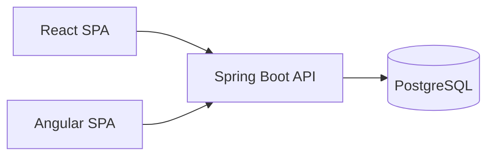
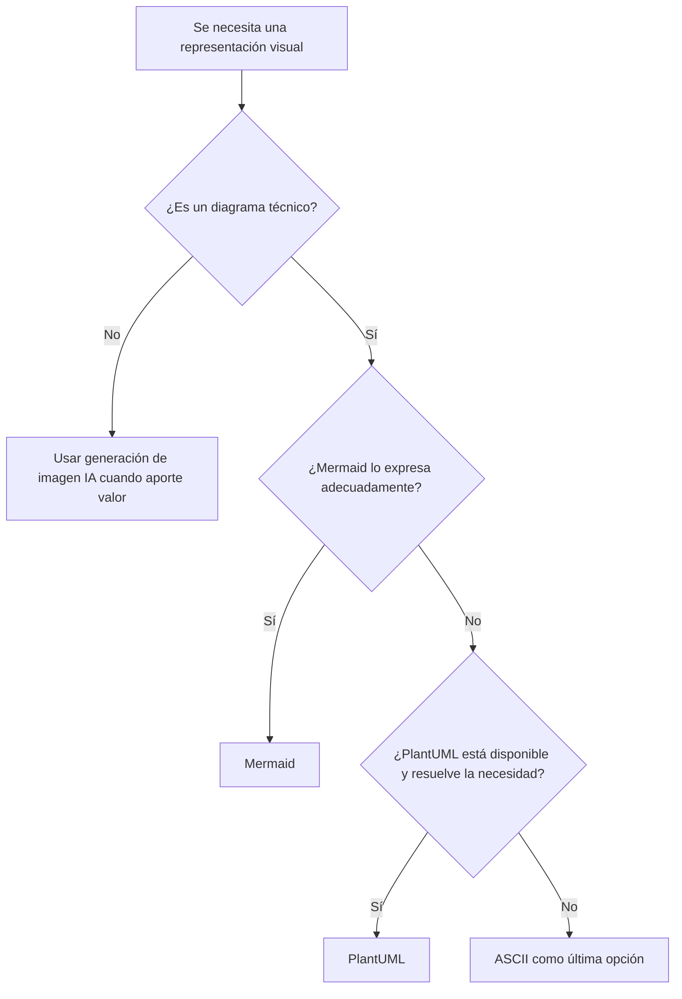

# Estándar de diagramas y visualización

Este documento define el estándar transversal para representar arquitectura, flujos, modelos, estados, dependencias y otras relaciones visuales dentro del repositorio.

## Orden obligatorio de preferencia

1. **Mermaid** — formato canónico por defecto.
2. **PlantUML** — fallback cuando Mermaid no pueda expresar adecuadamente el diagrama o la plataforma de destino no tenga soporte Mermaid.
3. **ASCII** — última opción, únicamente cuando no sea viable usar Mermaid ni PlantUML.
4. **Generación de imagen por IA** — usar cuando el objetivo sea una representación visual, ilustrativa, conceptual o comunicacional que no corresponda a un diagrama técnico versionable.

## Regla principal

Los diagramas técnicos deben mantenerse como **texto versionable dentro del repositorio** siempre que sea posible.

Esto permite:

- revisar cambios mediante Git;
- mantenerlos junto al código y documentación que describen;
- evitar imágenes binarias desactualizadas;
- reutilizarlos en GitHub, Markdown, documentación y material docente;
- modificar la representación sin depender de herramientas gráficas propietarias.

## Mermaid

Mermaid es el estándar principal para:

- diagramas de arquitectura;
- diagramas de flujo;
- secuencias;
- estados;
- relaciones entre entidades;
- journeys cuando corresponda;
- timelines;
- Git graphs;
- modelos C4 cuando la capacidad de Mermaid sea suficiente.

Ejemplo:



## PlantUML

PlantUML puede utilizarse cuando:

- Mermaid no soporte suficientemente el tipo de diagrama requerido;
- se necesite mayor expresividad UML;
- el entorno de destino no renderice Mermaid pero sí PlantUML;
- exista una necesidad técnica explícita que justifique el fallback.

El uso de PlantUML debe ser una decisión consciente, no una preferencia personal sobre Mermaid.

## ASCII

ASCII es la última opción.

Es válido para:

- una explicación efímera en consola;
- documentación que se consumirá en un entorno sin Mermaid ni PlantUML;
- una representación extremadamente pequeña donde incorporar otra tecnología agregaría más ruido que valor.

No debe utilizarse como formato canónico si el mismo contenido puede mantenerse razonablemente en Mermaid.

## Imágenes generadas por IA

Cuando el objetivo sea principalmente visual o comunicacional —por ejemplo, una infografía, una representación conceptual, una lámina pedagógica, una escena ilustrativa o una visualización que busque comunicar una idea más que definir una arquitectura— se debe privilegiar la capacidad de generación de imágenes por IA.

Una imagen generada **no reemplaza** el diagrama técnico canónico cuando el contenido requiere precisión arquitectónica o debe evolucionar junto al código.

Cuando ambos aporten valor pueden coexistir:

```text
Mermaid / PlantUML
→ fuente técnica canónica

Imagen generada por IA
→ representación visual complementaria
```

## Anti-patrones

Evitar:

- diagramas técnicos importantes solo como PNG/JPG;
- duplicar el mismo diagrama en Mermaid y una imagen manual que pueda divergir;
- utilizar ASCII por rapidez cuando Mermaid es perfectamente viable;
- generar con IA diagramas que requieren exactitud técnica sin conservar una fuente técnica versionable;
- documentar arquitectura únicamente mediante texto cuando una relación visual mejora sustancialmente la comprensión.

## Criterio de decisión



Este orden se aplica a nueva documentación y, cuando se modifique documentación existente, los diagramas ASCII relevantes deben migrarse progresivamente al formato canónico.