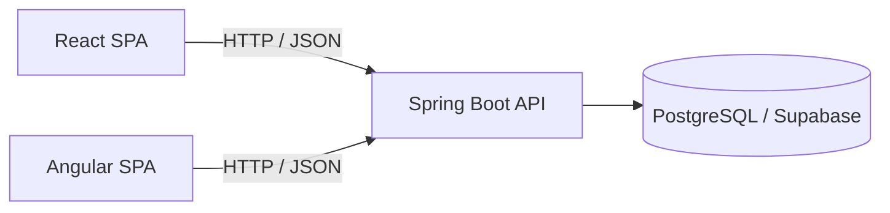
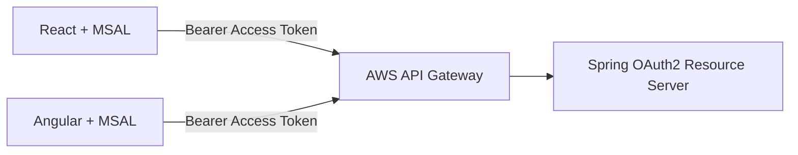

# Arquitectura · AulaTrack

## Objetivo

Demostrar que dos SPA construidas con frameworks distintos pueden consumir el mismo backend, mantener el mismo contrato funcional y aplicar posteriormente el mismo modelo OAuth2/OIDC.

## Responsabilidades

### `api/`

Única fuente de verdad para:

- dominio `Course` y `Task`;
- validaciones de negocio;
- persistencia;
- contrato REST;
- autenticación/autorización del recurso;
- integración posterior con API Gateway.

### `webapp-react/`

Cliente React del contrato REST. No contiene reglas exclusivas de negocio ni endpoints propios.

### `webapp-ng/`

Cliente Angular del mismo contrato REST. Debe poder realizar las mismas operaciones que React.

## Regla de equivalencia

Si una capacidad del negocio existe en una SPA, debe estar disponible mediante el contrato común de la API y poder implementarse en la otra SPA sin cambiar el backend.

## Seguridad objetivo

La incorporación de seguridad no cambia el dominio ni crea backends separados.

Scopes previstos:

- `tasks.read`
- `tasks.write`

Rol previsto:

- `ADMIN`

## Persistencia

El runtime utiliza PostgreSQL mediante una URL JDBC externalizada. En la baseline actual se utiliza Supabase como proveedor PostgreSQL; H2 queda reservado a tests automatizados para que la validación rápida del repositorio no dependa de infraestructura externa.

La decisión de persistencia cloud final se mantiene desacoplada del dominio y se documenta en [`base-de-datos.md`](base-de-datos.md).

## Estándar visual

Los diagramas técnicos de este repositorio siguen [`ESTANDAR-DIAGRAMAS.md`](ESTANDAR-DIAGRAMAS.md): Mermaid como formato canónico, PlantUML como fallback y ASCII solo como última opción. Las imágenes generadas por IA se reservan para visualización principalmente ilustrativa o comunicacional.
