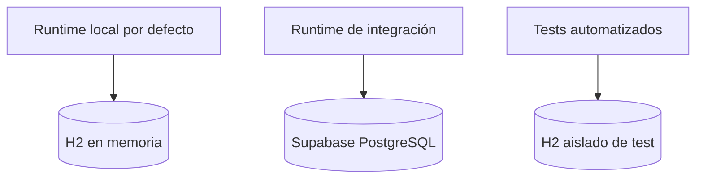
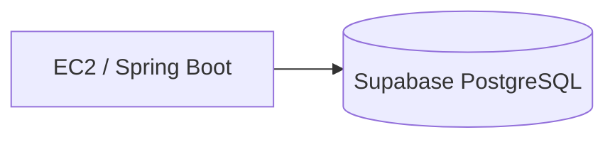
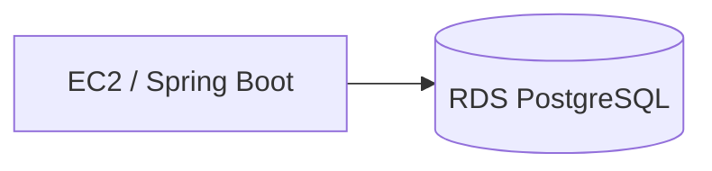
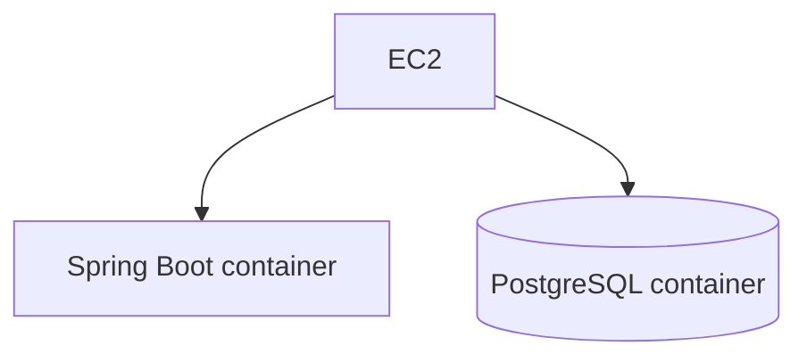

# Base de datos · modos locales e integración

## Estado actual

AulaTrack separa explícitamente **runtime local** de **integración real**:



La elección del datasource no cambia el contrato REST ni los frontends. React y Angular consumen únicamente la API Spring Boot.

## 1. Runtime local por defecto · H2

El modo local debe poder levantarse con cero configuración externa.

```bash
docker compose up --build
```

La API utiliza H2 en memoria mediante la configuración base `application.yml`.

Este modo sirve para:

- verificar que API, React y Angular arrancan juntos;
- validar el flujo funcional end-to-end local;
- ejecutar demos rápidas;
- trabajar sin conectividad externa;
- evitar que una dependencia cloud bloquee el desarrollo local.

La persistencia H2 es efímera: al reiniciar el proceso/contenedor se reconstruye el estado inicial.

## 2. Tests automatizados · H2 aislado

Los tests utilizan su propia configuración bajo `src/test/resources/application.yml`.

Esto permite que `quick-check` valide el backend sin depender de Supabase ni de infraestructura externa.

## 3. Integración real · perfil `supabase`

Supabase se utiliza cuando el objetivo es validar el comportamiento real contra PostgreSQL administrado.

Copiar:

```bash
cp .env.example .env
```

y completar:

```env
SPRING_PROFILES_ACTIVE=supabase
SUPABASE_DB_URL='jdbc:postgresql://HOST:5432/postgres?user=USER&password=PASSWORD&sslmode=require'
DB_SCHEMA=aulatrack
```

Luego:

```bash
docker compose up --build
```

El perfil `supabase` activa `application-supabase.yml`, que reemplaza el datasource H2 por PostgreSQL.

## Conexión recomendada a Supabase

Para Spring Boot/Hibernate utilizar el JDBC **Session Pooler** de Supabase, puerto `5432`, obtenido desde `Dashboard > Connect > JDBC`.

No utilizar el Transaction Pooler `6543` como datasource principal de Hibernate.

No versionar contraseña ni connection string real.

## Esquema Supabase

AulaTrack utiliza por defecto:

```text
DB_SCHEMA=aulatrack
```

Se evita trabajar directamente en `public`. Spring/Hibernate administra las tablas del ejercicio dentro del esquema de aplicación.

## Alternativas para el despliegue AWS de EV1

La decisión final queda abierta hasta validar restricciones y consumo de créditos del laboratorio de los estudiantes.

### Opción A · mantener Supabase



Ventajas:

- baja complejidad operativa;
- no consume créditos AWS de base de datos;
- separa claramente compute y datos;
- permite concentrar EV1 en EC2, API Gateway, identidad y seguridad.

Desventajas:

- la BD queda fuera de AWS;
- introduce una dependencia externa adicional.

### Opción B · Amazon RDS for PostgreSQL



Ventajas:

- arquitectura cloud más representativa;
- servicio administrado;
- evita administrar PostgreSQL manualmente dentro de EC2.

Desventajas:

- consume créditos/recursos del laboratorio;
- agrega configuración de red, seguridad y costos;
- puede distraer del objetivo principal de EV1 si la rúbrica no evalúa RDS.

### Opción C · PostgreSQL en Docker dentro de EC2



Ventajas:

- usa una sola VM;
- conceptualmente simple para una demo controlada;
- evita un servicio adicional.

Desventajas:

- mezcla aplicación y persistencia en el mismo host;
- exige administrar volumen, backup, puertos y ciclo de vida;
- es una práctica menos adecuada que un servicio administrado para una solución real.

## Criterio de decisión posterior

Antes de elegir la opción final para alumnos se debe comprobar:

1. servicios habilitados realmente dentro del AWS Academy Learner Lab;
2. presupuesto/créditos efectivos del laboratorio;
3. duración esperada de EC2/RDS;
4. peso real de persistencia en la rúbrica de EV1;
5. complejidad adicional que cada alternativa introduce al ejercicio.

Hasta esa revisión:

- **H2** es el datasource canónico del runtime local rápido;
- **Supabase PostgreSQL** es el datasource canónico de integración;
- la elección final para AWS permanece abierta.
